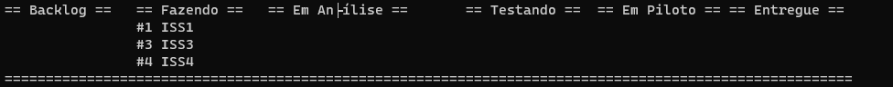
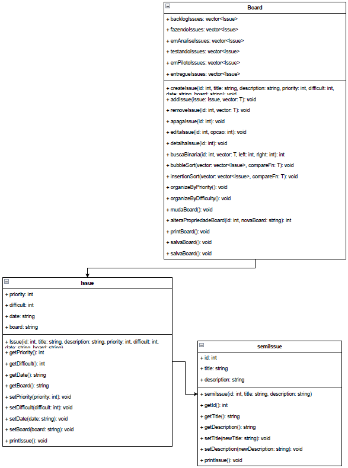

#Projeto Kanban
## Projeto em C++ para a disciplina de Linguagem de Programação I
Feito por [Márcio Victor de Andrade Rocha](https://github.com/marciusvic).
### Descrição do Projeto
O projeto consiste em um programa que simula um quadro Kanban, onde o usuário pode criar, editar e excluir tarefas(basicamente operações CRUD), além de poder visualizar as tarefas de acordo com o status em que se encontram. Além disso o usuário pode ordenar as tarefas de acordo com a dificuldade(seguindo regra de numeração fibbonacci) ou de acordo com a prioridade.

### Como compilar e executar o programa
Para compilar o programa, o usuário deve digitar 'make' no terminal(Linux), caso esteja no windows tente 'mingw32-make'. Para executar o programa.

### Complexidade algoritimos de ordenação
O programa possui dois algoritimos de ordenação, o primeiro é o algoritimo de ordenação por inserção(insertionSort(std::vector<Issue> &vector, T compareFn) está presente na classe Board), que possui complexidade O(n²)(no pior caso), e o segundo é o algoritimo de ordenação por trocas(bubbleSort(std::vector<Issue> &vector, T compareFn) está presente na classe Board), que possui complexidade O(n²)(no pior caso).

### Imagens do projeto
##Tela inicial

##Menu de opções

##Criar Issue

##Mover Issue

##Editar Issue

##Apagar Issue

##Board para visualização das Issues

##Diagrama UML

